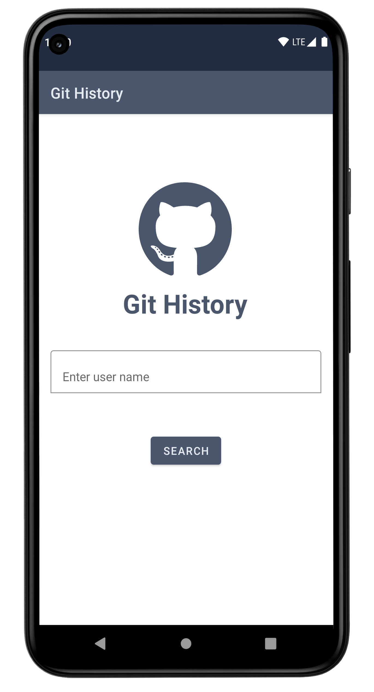
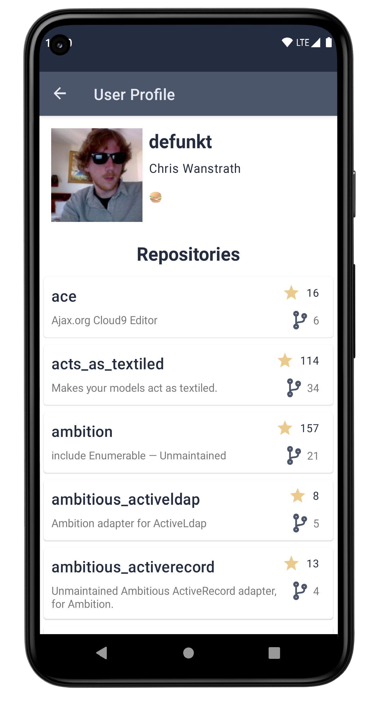
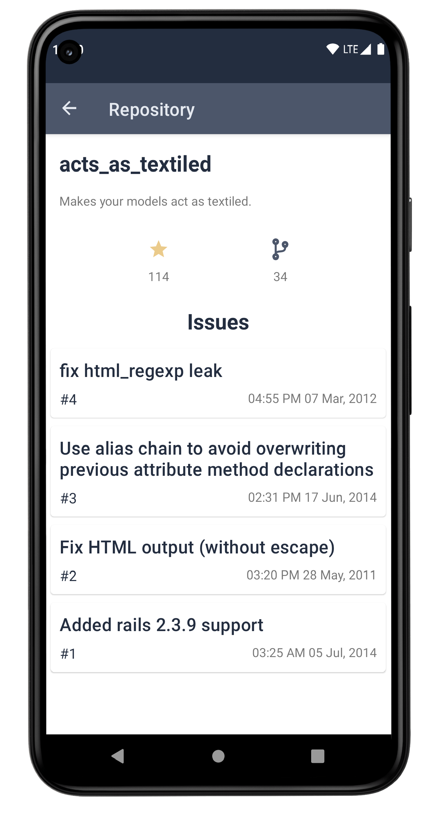
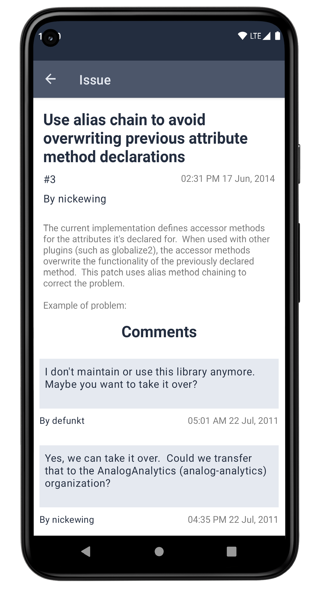

# Git History

## About

Git history is an android application that simply tracks GitHub repository's issues. You can search for user and get all public repositories of this user. For each repository, you can get issues and its description.

## Screenshots

<table>
  <tr>
    <td></td>
    <td></td>
  </tr>
  <tr>
    <td></td>
    <td></td>
  </tr>
</table>

## Built with

- Kotlin : First class and official programming language for Android development.
- Android Architecture Components :
    - LiveData : Data types that implement observer pattern.
    - ViewModel : Handles UI logic and helps to maintain state during configuration changes.
- Coroutines : For asynchronous programming
- Navigation components : For better navigation handling.
- Dagger : Standard library to incorporate Dagger dependency injection into an Android application.
- Glide : a fast image loading framework for Android.
- Retrofit : A type-safe HTTP client for Android and Java.
- Moshi : A modern JSON library for Kotlin and Java.
- Moshi Converter : A Converter which uses Moshi for serialization to and from JSON.
- Espresso : UI testing framework
- JUnit4 : Unit testing framework

## Developed with

- [MVVM](https://developer.android.com/jetpack/docs/guide#recommended-app-arch) architecture
- Clean architecture
- Test driven development
- Monolithic architecture

  

## Contribute

If you want to contribute to this app, you're always welcome!
See [Contributing Guidelines](CONTRIBUTING.md).